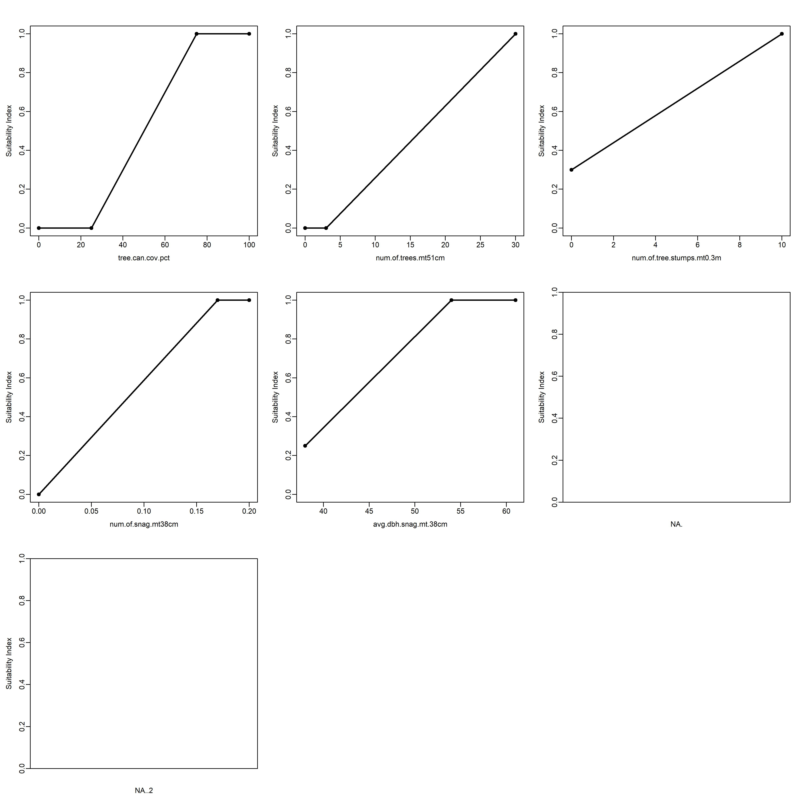
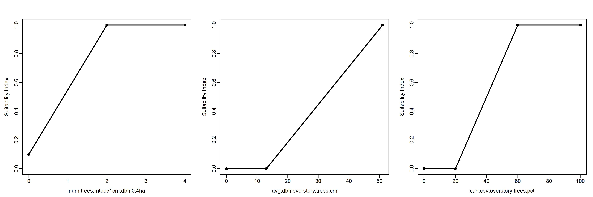
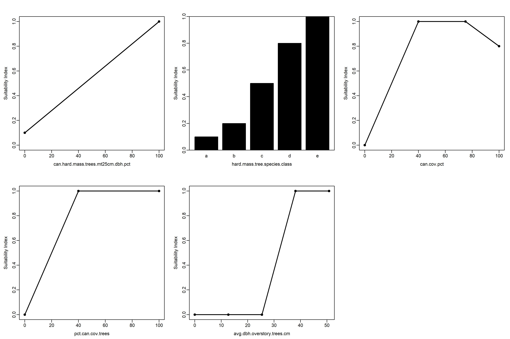
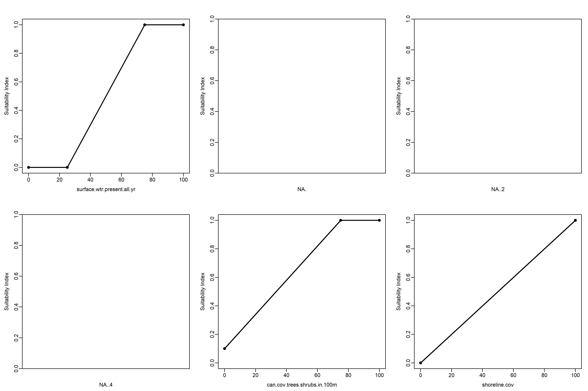
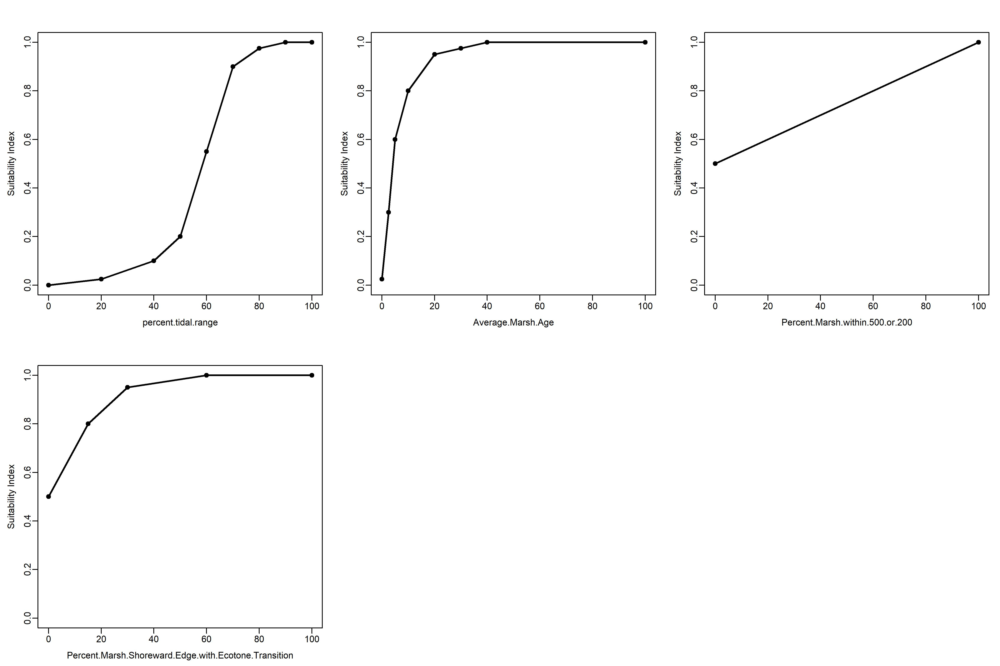
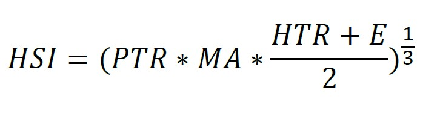

## **Abstract**   

The U.S. Army Corps of Engineers (USACE) engages in a large variety of decisions affecting ecological outcomes such as ecosystem restoration of oyster reefs, environmental flows for imperiled fishes, and bird breeding grounds impacted by dredge material management. A common approach to ecological modeling of environmental impacts and benefits is based on the quantity and quality of habitats. No standard modeling platform exists for computing outcomes from these "index" models, and users often develop ad hoc spreadsheet models. Here, we present a generic, flexible, error-checked index modeling platform applicable Nationwide, which we refer to as the "ecorest" modeling framework. Four modules compose this framework. First, model parameters are compiled as a data set and associated metadata for 349 habitat suitability models developed by the U.S. Fish and Wildlife Service. Second, functions are presented for conducting habitat suitability analyses for both the models described above as well as generic user-specified model parameterizations. Third, a suite of decision support tools are presented for conducting cost-effectiveness and incremental cost analyses. These three modules are all contained within an open source modeling package for the R Statistical Software Language called [`ecorest`](https://cran.r-project.org/web/packages/ecorest/index.html). This modeling platform seeks to standardize availability and application of index models within the USACE.


*Author Headnotes*:  

* Corresponding Author: Darixa D. Hernandez-Abrams, U.S. Army Engineer Research and Development Center (ERDC), Environmental Laboratory (EL), Vicksburg, M.S., darixa.d.hernandez-abrams@usace.army.mil  
* This report provides an overview of development of an ecological modeling platform for USACE model certification. Model source code has been previously reviewed and released as the [`ecorest`](https://cran.r-project.org/web/packages/ecorest/index.html) "package" by the Comprehensive R Archive Network ([CRAN](https://cran.r-project.org/)). This report will simultaneously undergo peer review as an ERDC Technical Report.  
* All analyses are conducted in the (ACE-IT approved) R Statistical Software.  
* Color schemes may seem non-traditional (i.e., non-rainbow arrays), but colors were chosen for maximum understanding by color deficient audiences. Nationwide, approximately 8% of men and 0.5% of women exhibit some form of color deficiency. In USACE, supervisors (GS-13 or higher) are ~74% male and ~26% female, which results in a 6% chance of a team member exhibiting color-blindness (1 out of 17). Among USACE decision makers, army officers (O4 or higher) are ~85% male and ~15% female, which results in a 7% chance of a team member exhibiting color-blindness (1 out of 15). Specifically, `ecorest` uses [viridis](https://cran.r-project.org/web/packages/viridis/vignettes/intro-to-viridis.html) color schemes. 


```{r, echo=FALSE, message=FALSE}

#Clear local memory
#rm(list=ls(all=TRUE))

##########
#Load all necessary R packages
library(viridis)    #Contains color-blind friendly color schemes
library(ecorest)    #Contains habitat suitability and CEICA models

# Load only data from the installed ecorest package
data("HSImodels", package = "ecorest")
data("HSImetadata", package = "ecorest")

# Updated local functions from Git package-update project
ecorest_update_path <- "E:/backup_Oct_20_25/EmergingApproaches_Ecomod/Ecorest_cert/Git_ecorest/ecorest-pkg-update2/R"
# Update for local functions - Kiara
ecorest_update_path <- "E:/ecorest/ecorest package/ecorest_2.0.3/ecorest/R"

source(file.path(ecorest_update_path, "HSIplotter.R"))
source(file.path(ecorest_update_path, "SIcalc.R"))
source(file.path(ecorest_update_path, "HSIarimean.R"))
source(file.path(ecorest_update_path, "HSIgeomean.R"))
source(file.path(ecorest_update_path, "HSIwarimean.R"))
source(file.path(ecorest_update_path, "HSImin.R"))
source(file.path(ecorest_update_path, "HSIeqtn.R"))
source(file.path(ecorest_update_path, "HUcalc.R"))
source(file.path(ecorest_update_path, "annualizer.R"))
source(file.path(ecorest_update_path, "CEfinder.R"))
source(file.path(ecorest_update_path, "BBfinder.R"))
source(file.path(ecorest_update_path, "CEICAplotter.R"))

```


## **1. Background**

Across all business lines, the U.S. Army Corps of Engineers (USACE) engages in a large variety of decisions that affect a multitude of ecological outcomes (e.g., ecosystem restoration of oyster reefs, environmental flows for imperiled fishes, and bird breeding grounds impacted by dredge material management). While numerous aquatic, riparian, and terrestrial analytical tools exist, ecological models typically have not been easily accessible or in the most usable form for field practitioners and often require significant data and modeling expertise to effectively employ. However, ecological models must be used to quantify environmental impacts and benefits throughout the project life-cycle (i.e., planning, engineering, construction, operations, and maintenance phases). 

A common approach to ecological modeling of environmental impacts and benefits is based on quantity and quality of habitat. These "index" models (Swannack et al. 2012) were originally developed for species-specific applications (e.g., slider turtles), but the general approach has also been adapted to guilds (e.g., salmonids), communities (e.g., floodplain vegetation), and ecosystem processes (e.g., the Hydrogeomorphic Method). No standard platform exists for computing outcomes from index models, and users often develop ad hoc spreadsheet models, which are highly prone to numerical errors (McKay 2009). The common quantity-quality structure of index models provides an opportunity to develop a consistent, error-checked index modeling calculator adaptable to a variety of applications across the Corps of Engineers.

Furthermore, ecological modeling often seeks to inform trade-offs between a monetary assessment of social benefits or costs (e.g., restoration investment cost or economic damages avoided) and a non-monetary assessment of environmental benefits and costs (e.g., habitat gains of restoration or impact to an imperiled taxon's habitat). Cost-effectiveness and incremental cost analyses (CEICA) provide a useful set of techniques for comparing non-monetary and monetary costs and benefits of management actions (Robinson et al. 1995). CEICA is commonly applied in planning and designing ecosystem restoration projects and is often coupled with index models to inform management decisions.  


#### *1.1 Problem Statement*

This document describes a set of computational tools for assessing ecological outcomes with index models and informing trade-offs between monetary and non-monetary outcomes. The following topics guided the scope of this analysis:  

* *Model Purpose*: Ad hoc development of index models is leading to significant USACE investments in computational tool development, user learning, model review, and certification. This platform seeks to provide an error-checked, computationally accurate tool for assessing ecological outcomes with index models. Furthermore, the platform should also provide seamless integration of decision support tools to avoid potential errors associated with data transfer between separate ecological and decision models.  
* *Target Application*: This toolkit is intended primarily for USACE ecosystem restoration planning; however, index models are also often applied for impact assessment, compensatory mitigation, and wetland regulatory issues.  
* *Target Users:* The primary audience for these tools is USACE planners, biologists, and engineers involved in ecosystem restoration projects or environmental evaluations.  
* *Model Engine:* This document addresses the development of computational engines for index models and decision support tools, both of which are developed as the `ecorest` "package" for broad distribution via the [R statistical software language](https://cran.r-project.org/). The R-package may be accessed through the (ACE-IT approved) R freeware and associated user-interfaces such as [RStudio](https://rstudio.com/). 
* *Modular Design:* All model capabilities are developed as separate databases and functions, which can be accessed independently. For instance, the toolkit is intended to provide "one stop shopping" for USACE restoration planning needs by integrating index and decision support models. However, users may also use non-index models (e.g., population demography models via `popbio`) to examine other ecological outcomes in the decision modules. Likewise, users could compute index model outcomes without using decision support tools.  


**Ultimately, the overarching objective of this model is to develop a technically sound and computationally accurate suite of tools for assessing ecosystem impacts in restoration project planning or habitat assessments with index models, which are easily accessible for use by USACE planners, biologists, and engineers.** This report describes the development of a suite of modeling tools called `ecorest`. While developed for ecosystem restoration applications, the tools may be applied in a variety of other contexts including impact assessment and non-restoration cost-benefit analysis. 


#### *1.2. Model Development Process*  


Models were developed following a general ecological modeling process, which incorporates conceptualization, quantification, evaluation, application, and communication phases (Grant and Swannack 2008). Tools were *conceptualized* based on common approaches to index modeling. Generic functions were then developed to *quantify* index model and decision support outcomes, which were "packed" for use in the R Statistical Software. Models are then *evaluated* relative to their numerical accuracy and usability. Finally, *application and communication* of models is demonstrated through a series of appendices with step-by-step instructional guides and example applications on USACE restoration studies. 

Models were iteratively developed and checked. Functions were initially developed and tested by the authors and other ERDC Environmental Laboratory staff. Models were then expanded and generalized in the form of the `ecorest` R-package, which was subsequently reviewed and posted online via the Comprehensive R Archive Network ([CRAN](https://cran.r-project.org/web/packages/ecorest/index.html)). All versions of the final `ecorest` package were then formally tested against known verified model outcomes, and example applications were developed for demonstration purposes. 


This report is organized around the modeling process followed. Each section describes the technical basis of index-based models, along with their execution in `ecorest`. Report appendices provide additional information about models such as formal testing, user guides, and numerous example applications. This document is intended to provide documentation of the model's technical details, use, and relevant information for USACE model certification (EC 1105-2-412, PB 2013-02).


## **2. Conceptualization**


The `ecorest` platform synthesizes two major analytical approaches within a single numerical framework. First, index models are a common ecological modeling approach used in assessing impacts and benefits of environmental management actions. Second, cost-effectiveness and incremental cost analysis (CEICA) are decision support tools for informing decisions involving non-commensurate metrics such as non-monetary ecological outcomes and monetary costs. Finally, the `ecorest` modeling platform provides a computational workflow for uniting these analyses to inform ecosystem restoration decision-making. The following sections review the conceptual foundation for each of these topics separately.


#### *2.1. Index-Based Ecological Models*  


Ecological models have become common tools for informing decisions related to the management of complex ecological processes. Models span the breadth of their potential ecological management applications such as seafood harvest limits, transport of nutrients into freshwaters, bioaccumulation of contaminants, management of imperiled taxa, and wetland impact assessment. In addition to diverse outcomes, ecological models often take on a variety of theoretical constructs ranging from theoretical, analytical models to statistical correlations of variables to agent-based simulations of animal movement (see Swannack et al. 2012 for a review of ecological model types). The diversity of ecological endpoints and model constructs has led to a wide array of tools applicable to ecosystem management and restoration.  

Index models are a family of techniques commonly applied in planning ecosystem restoration projects. Briefly, index models quantitatively translate multiple features or processes into a relative assessment of habitat suitability for a given organism or a relative assessment of ecosystem condition (Tirpak et al. 2009, Swannack et al. 2012). More specifically, index models combine assessments of habitat or ecosystem quality and quantity into an overarching metric for assessing the relative condition of a site (e.g., a "habitat unit" or "functional capacity unit"). Quantity is commonly expressed as a metric of area such as acres or hectares; however, other metrics may be appropriate to specific applications such as river length or lake volume. Quality is then assessed by identifying key variables correlated with habitat or ecosystem condition. Each variable is then translated into a suitability index curve, which transforms dimensional quantities such as flow velocity into dimensionless values of quality (0 to 1 where 0 is unsuitable/low condition and 1 is suitable/ideal condition). Multiple suitability curves are then combined through various equational forms into an overarching assessment of habitat quality (e.g., a "habitat suitability index" or "functional capacity index"). 

Index models may be derived from a variety of methods and resources. Like all models, many index model developers have emphasized that these algorithms simplify complex ecosystems, and thus, these tools should be considered adaptable hypotheses rather than mechanistic, cause-effect relationships. The value of index models lies in their utility for quantitatively comparing the relative merits of alternative management actions and testing hypotheses. The following represent the most common sources of index models applied to USACE ecosystem restoration projects:  

* *U.S. Fish and Wildlife Service (USFWS) Habitat Suitability Index (HSI) Models:* The HSI approach quantitatively relates the potential for species presence to habitat characteristics. Species have complex relationships with their environment, and HSI models provide a simple method for characterizing the potential for habitat to support target species across a landscape. The USFWS led the development of 500+ HSI models in the 1970-1980s to support environmental management decisions nationwide (https://www.nwrc.usgs.gov/wdb/pub/hsi/hsiindex.htm). The quantitative relationships between species and habitat were generally based on a combination of literature, field studies, and expert opinion, and the reports are colloquially referred to as the "blue books" because of the blue covers binding the original publications.    
* *Hydrogeomorphic Method (HGM) of Wetland Assessment:* Similarly, the HGM approach is a common technique for rapidly assessing wetland function. The HGM methodology for model development is thoroughly documented (Brinson 1993, Smith et al. 1995), and models are available for 30+ wetland types nationwide (https://wetlands.el.erdc.dren.mil/guidebooks.cfm).  
* *Literature-Based Index Models:* Index models also appear within the peer-reviewed and grey literature in a variety of formats. Some of the original HSI models have been subsequently adapted to local conditions or updated as new data became available (e.g., the bluegill model by Stuber et al. 1982 was adapted by Palesh and Anderson 1990). Models also appear in the peer-reviewed literature as new data become available, such as a recent revision to oyster suitability models which expands the breadth of applicability (Swannack et al. 2014).
* *Project- or Objective-Centric Index Models:* Specific restoration projects may build models unique to a set of project objectives (McKay et al. 2019), which can evolve as a project proceeds from preliminary screening to detailed alternatives analysis (e.g., McKay et al. 2018ab). More recently, Carrillo et al. (2020) proposed a Toolkit for interActive Modeling (TAM), which facilitates development of index models in real-time for mediated modeling workshop settings (Herman et al. 2019).


#### *2.2. Cost-Effectiveness and Incremental Cost Analysis (CEICA)*  


The USACE ecosystem restoration mission was first authorized in the Water Resources Development Act of 1986 with the stated purpose “…to restore significant structure, function and dynamic processes that have been degraded” (USACE 1999, ER 1165-2-501). Given this goal, USACE programs emphasize ecological outcomes (as opposed to social or economic outcomes). Generally, ecological resources may be quantified in a variety of ways ranging from habitat suitability for a focal taxon (e.g., an endangered species) to changes in physical processes (e.g., sediment delivery from geomorphic change) to changes in biological processes (e.g., carbon uptake and storage). In other USACE business lines (e.g., navigation), costs and benefits of actions are compared in monetary terms, and the benefit-cost ratio serves as a crucial decision metric. However, outputs of restoration are typically not monetized, and a different set of methods are required to inform restoration decision-making and address the issue of “Is ecosystem restoration worth the Federal investment?” In particular, cost-effectiveness and incremental cost analyses provide techniques for comparing non-monetary ecological benefits relative to monetary costs of restoration actions (Robinson et al. 1995).

Cost-effectiveness and incremental cost analyses (CEICA) are analytical tools for assessing the relative benefits and costs of ecosystem restoration actions and informing decisions. Benefits and costs are assessed prior to these analyses using ecological models (e.g., index models) and cost engineering methods, respectively. CEICA may then be conducted at the site scale to compare alternatives at a single location (e.g., no action vs. dam removal vs. fish ladder) or at the system scale to compare relative merits of multiple sites (e.g., no sites vs. Site-A only vs. Site-B only vs. Site-A and Site-B). Within the USACE, the Institute of Water Resources has provided a toolkit for conducting CEICA, the IWR Planning Suite (http://www.iwr.usace.army.mil/Missions/Economics/IWR-Planning-Suite/).

Cost-effectiveness analysis provides a mechanism for examining the efficiency of alternative actions. For any given level of investment, the agency wants to identify the plan with the highest return-on-investment (i.e., the most environmental benefits), and for any given level of environmental benefits, the agency wants a plan with the lowest cost. An “efficiency frontier” identifies all plans that efficiently provide benefits on a per cost basis (i.e., cost-effective plans). These "non-dominated" alternatives compose the Pareto-optimal frontier.

Incremental cost analysis is conducted on the set of cost-effective plans. This technique sequentially compares each plan to all higher cost plans to reveal changes in unit cost as output levels increase and eliminates plans that do not efficiently provide benefits on a per unit cost basis. Specifically, this analysis examines the slope of the cost-effectiveness frontier to isolate how the incremental unit cost ($/unit) increases as the magnitude of environmental benefit increases. Incremental cost analysis is ultimately intended to inform decision-makers about the consequences of increasing unit cost when increasing benefits (i.e., each unit becomes more expensive). Plans emerging from incremental cost analysis efficiently accomplish the objective relative to unit costs and are typically referred to as “best buys.” Importantly, all “best buys” are cost-effective, but all cost-effective plans are not best buys.


#### *2.3. `ecorest` Model Workflow*  


Conceptual models provide a useful mechanism for many aspects of ecosystem restoration projects such as increasing understanding about a subject, identifying restoration alternatives, and facilitating dialog among team members (Fischenich 2008, USACE 2011). However, conceptual models also inform the development of quantitative ecological models and can document the general workflow of models (Grant and Swannack 2008, Swannack et al. 2012). Here, a conceptual model is presented to describe the general workflow of the `ecorest` computational platform. A stepwise conceptual model development process (Fischenich 2008) was used to develop the model workflow (Table 1), and Figure 1 summarizes the general flow of logic guiding the development of `ecorest`.


```{r, echo=FALSE, include=FALSE, warning=FALSE}
#Create empty table
Table1 <- as.data.frame(matrix(NA, nrow = 5, ncol = 2))
colnames(Table1) <- c("Step", "ecorest")

#Specify rows of the table
Table1[1,] <- c("1. State the model objectives.", "Develop a technically sound and computationally accurate suite of tools for assessing ecosystem restoration project planning with index models and informing restoration decisions, which are easily accessible for use by USACE planners, biologists, and engineers.")
Table1[2,] <- c("2. Bound the system of interest.", "Index models of ecological systems structured around the quantity and quality of habitat, where quality is defined by a set of independent variables and suitability index curves.")
Table1[3,] <- c("3. Identify critical model components within the system.", "The model platform needs to include six basic elements: (1) a generic format for defining suitability index curves, (2) a library of existing index models developed by the U.S. Fish and Wildlife Service, (3) a computational engine for computing index model outcomes, (4) a computational engine for conducting decision support modeling, and (5) a simple, adaptable, and modular input-output structure")
Table1[4,] <- c("4. Articulate relationships among model components.", "Components interact through a modular workflow in which model inputs are used to build suitability relationships, index-model functions compute habitat outputs, and decision-support functions utilize those outputs to evaluate trade-offs.")
Table1[5,] <- c("5. Represent the conceptual model.", "Figure 1 provides an overview of computational workflow for the `ecorest` modeling platform")

##########
#Send output table
rownames(Table1) <- NULL
knitr::kable(Table1, caption="**Table 1. Stepwise development of the ecorest conceptual model (following steps in Fischenich 2008).**") 

```


## **3. Quantification**

In the quantification step, the conceptual ecological model is converted into explicit equations, parameter definitions, and a numerical procedure for computation (Grant and Swannack 2008). This section describes the theoretical basis for `ecorest`, the approach used to compile the toolkit and the associated functions. 

`ecorest` contains three categories of datasets and analytical functions designed to support ecosystem restoration decision-making, with an emphasis on U.S. Army Corps of Engineers applications. First, a common data structure was developed for index models, data were compiled for existing habitat suitability index (HSI) models, and a Toolkit for interActive Modeling (TAM) was developed to facilitate development of new index models (Carrillo et al. 2019). Second, an engine was developed for computing index models with functions for both generic model evaluation outputs (e.g., suitability curve visualization and sensitivity analysis) and application-specific outputs (e.g., forecasts of with and without project conditions). Third, a series of functions were developed to conduct cost-effectiveness and incremental cost analyses (CEICA), which can be applied to index model outputs or any other trade-off between benefits and costs. These three topics are synthesized into a R-package (McKay, Hernandez-Abrams, and Cushway 2026) and will be the focus of this report.

R is a free, open-source language and software environment for statistical computing and graphics maintained by the R Core Team and supported by the R Foundation (R Core Team, 2024). R supports reproducible, script-based workflows and is extended through “packages,” which bundle functions, documentation, and (when applicable) datasets into a standardized structure that can be installed and executed consistently across operating systems.

The [ecorest package page](https://CRAN.R-project.org/package=ecorest) is distributed through the Comprehensive R Archive Network (CRAN), the primary public repository for R packages. CRAN maintains repository policies and uses automated checks (including installation and “R CMD check” style testing) to evaluate package structure, documentation, dependencies, and runnable examples across platforms. Packages are routinely re-checked over time as R and dependencies change, and maintainers may be required to address issues to remain compliant, while non-compliant packages may be archived. See the [ecorest package page](https://CRAN.R-project.org/package=ecorest) for details.


#### *3.1. USFWS Habitat Suitability Model Data*  

The `ecorest` package includes a compiled library of USFWS HSI models implemented in a standardized digital format to improve accessibility, reduce transcription error, and support repeatable computations. The data structures presented in **Section 3.1** store the curve breakpoints and coding conventions needed to reconstruct published suitability relationships, while model metadata document model details (e.g., geographic range, scientific name), intended application context, and citation information. Together, these datasets provide the inputs required for the index model calculations described in **Section 3.2**.


*`HSImodels$modelname`*

This list of data frames contains 349 U.S. Fish and Wildlife Service Habitat suitability index (HSI) models approved for USACE use by the Ecosystem Planning Center of Expertise (ECO-PCX). Each data frame contains independent variables and associated habitat suitability indices (ranging from zero to one). Data represent known breakpoints in curves, and linear extrapolation is used to define values between breakpoints. Categorical input variables are coded as letters. A comprehensive list of all models is included in Appendix B. Variable names often required abbreviation, and all nomenclature is also summarized in Appendix B. Table 2 provides an example of one such HSI model designed for the Barred Owl (*Strix varia*) (Allen 1987). All models can be called with their corresponding model name using `HSImodels$modelname` (e.g., `HSImodels$barredowl`).

```{r}
Table2 <- HSImodels$barredowl
knitr::kable(Table2, caption="**Table 2. Example of USFWS Habitat Suitability Model Data for the Barred Owl (*Strix varia*) (Allen 1987).**")

```

*`HSImetadata`*

This data frame contains metadata for 349 U.S. Fish and Wildlife Service Habitat suitability index (HSI) models, such as model names, references, input parameters, and model equations. Table 3 provides a full list of all fields contained within `HSImetadata` along with an example for the Barred Owl model (Allen 1987).

```{r echo=FALSE}
# Variable descriptions from R-package
Table3 <- data.frame(c("Model name", "Model specifications", "Scientific nomenclature of modeled taxa", "Geographic range of organism", "Type of habitat", "Citation of original model", "Conditions under which model may be applied", "Link to original individual model source", rep("Suitability index values for each organism-specific condition", 32), "Food component equation", "Food/reproduction component equation", "Roosting-nesting component equation", "Cover component equation", "Cover-roosting component equation","Cover-reproduction-food component equation", "Cover-food component equation","Cover-food shrub component equation", "Cover-food herbaceous component equation", "Winter food component equation", "Summer food component equation","Fall food component equation", "Water component equation", "Cover-breeding component equation", "Brood component equation", "Nest component equation", "Nest-brood-cover component equation", "Cover nesting component equation", "Pair habitat component equation", "Water quality component equation", "Reproduction component equation", "Cover reproduction component equation", "Disturbance component equation", "Other component equation", "Larval component equation", "Embryo and larval component equation", "Embryo component equation", "Juvenile component equation", "Fry component equation", "Spawning component equation", "Adult component equation", "Island component equation", "Interspersion component equation", "Non-island component equation", "Winter cover food component equation", "Summer food brood component equation"," Fall spring winter food component equation", "Spring food component equation", "Winter cover component equation", "Fall to spring cover component equation", "Substrate-suspended solids component equation", "Topography component equation", "Temperature component equation", "Juvenile adult component equation", "Composite HSI model equation in R syntax"))

# #Variable names from R-package
Table3$names <- colnames(HSImetadata)
 
# #Isolate barred owl model on row 32 (which(HSImetadata$model=="barredowl"))
Table3$barred <- paste(t(HSImetadata[32,]))

# Fix formatting of scientific name and CR
Table3$barred[3] = paste0("*Strix varia*")
Table3$barred[61] = paste0("((SIV1\\*SIV2)^(1/2))\\*SIV3")

# #end pretty table output
colnames(Table3) <- c("Description", "HSImetadata Field", "Barred Owl Model Value")
rownames(Table3) <- NULL
knitr::kable(Table3, caption="**Table 3. Example of model information embedded within HSImetadata(): Barred Owl (Allen 1987).**")

```

#### *3.2. Index Model Computational Engine*  

The index model computational engine in `ecorest` is implemented as a modular workflow that separates (1) representation and visualization of suitability relationships, (2) calculation of suitability indices from project inputs from USFWS models (**Section 3.1**) or user-specified models, (3) calculation of suitability indices into an overall HSI score using documented combination rules, and (4) conversion of HSI to habitat units using habitat quantity and HSI scores. This modular structure promotes computational transparency, supports verification against known outcomes, and allows functions to be used independently when only part of the workflow is needed.


*`HSIplotter(SI, figure.name)`*

The `HSIplotter` function plots suitability index curves relative to HSI model input parameters. 

Inputs include:  

* `SI`: a matrix or data frame of suitability curves ordered as parameter breakpoints and associated suitability indices for each parameter with appropriate column names.  
* `figure.name`: output figure file name structured as "filename.jpeg".

The `HSIplotter` function returns a multi-panel *.jpeg figure showing all suitability curves included in a model (e.g., Figure 2).

```{r echo=TRUE, warning=FALSE}

HSIplotter
HSIplotter(HSImodels$barredowl, "Fig02.BarredOwl.jpeg")

```


<br>

*`SIcalc(SI, input.proj)`*

The `SIcalc` function computes suitability indices given a set of suitability curves and project-specific inputs. Suitability indices may be computed based on either linear interpolation (for continuous variables) or a look-up method (for categorical variables). 

Inputs include:  

* `SI`: a matrix or data frame of suitability curves ordered as parameter breakpoints and associated suitability indices for each parameter with appropriate column names.   
* `input.proj`: a numeric or categorical vector of application-specific input parameters associated with the suitability curve data from SI. Excluded variables should be entered as 'NA.'

The `SIcalc` function returns a named vector of suitability index values between zero and one corresponding to the given user inputs. 

```{r echo=TRUE}

SIcalc

```


*`HSIarimean(x)`*

The `HSIarimean` function uses an arithmetic mean equation to combine suitability indices into an overarching habitat suitability index.

Inputs include:

* `x`: a vector, matrix, or data frame of suitability indices ranging from zero to one.  

The `HSIarimean` function returns a value of habitat quality between zero and one (ignoring NA values). **Note that new models developed using the `HSIarimean` function must undergo certification by ECO-PCX prior to USACE use.**

```{r echo=TRUE}
HSIarimean
```


*`HSIwarimean(x, w)`*

The `HSIwarimean` function uses a weighted arithmetic mean equation to combine suitability indices into an overarching habitat suitability index.

Inputs include:

* `x`: a vector, matrix, or data frame of suitability indices ranging from zero to one.  
* `w`: a vector,  matrix, or data frame of weights ranging from zero to one (must sum to one).  

The `HSIwarimean` function returns a value of habitat quality between zero and one (ignoring NA values). **Note that new models developed using the `HSIwarimean` function must undergo certification by ECO-PCX prior to USACE use.**


```{r echo=TRUE}
HSIwarimean
```


*`HSIgeomean(x)`*

The `HSIgeomean` function uses a geometric mean equation to combine suitability indices into an overarching habitat suitability index.

Inputs include:

* `x`: a vector, matrix, or data frame of suitability indices ranging from zero to one.  

The `HSIgeomean` function returns a value of habitat quality between zero and one (ignoring NA values). **Note that new models developed using the `HSIgeomean` function must undergo certification by ECO-PCX prior to USACE use.**


```{r echo=TRUE}
HSIgeomean
```


*`HSImin(x)`*

The `HSImin` function calculates the minimum of a given set of suitability indices to determine an overarching habitat suitability index.

Inputs include:

* `x`: a vector, matrix, or data frame of suitability indices ranging from zero to one.  

The `HSImin` function returns a value of habitat quality between zero and one (ignoring NA values). **Note that new models developed using the `HSImin` function must undergo certification by ECO-PCX prior to USACE use.**


```{r echo=TRUE}
HSImin
```


*`HSIeqtn(HSImodelname, SIV, HSImetadata, exclude)`*

The `HSIeqtn` function computes a habitat suitability index based on equations specified in USFWS habitat suitability models contained within `ecorest` via `HSImodels` and `HSImetadata`. Habitat suitability indices represent an overall assessment of habitat quality from combining individual suitability indices for multiple independent variables. The function computes an overall habitat suitability index. This function only applies to built-in index models described in Section 3.1.

Inputs include:

* `HSImodelname`: a character string in quotations that must match an existing model name in `HSImetadata`.  
* `SIV`: a named vector, matrix, or data frame of suitability index values ranging from zero to one used in the model specified in `HSImodelname`. Names must correspond exactly with SIV names (e.g., "SIV1", "SIV1B", "SIV2", etc.) 
* `HSImetadata`: a data frame of HSI model metadata stored in the `ecorest` package. 
* `exclude`: a vector of character strings specifying components to be excluded from calculations. See `HSImetadata` for a list of available model components. Non-NULL 'exclude' inputs are only applicable to models that explicitly provide instructions for use in the note column of `HSImetadata`.

The `HSIeqtn` function returns a numeric estimate of habitat quality between zero and one. **Predefined USFWS models contained in `ecorest` are certified for USACE use by ECO-PCX.**


```{r echo=TRUE}
HSIeqtn
```


*`HUcalc(SI.out, habitat.quantity, HSIfunc, ...)`*

The `HUcalc` function computes habitat units given a set of suitability indices ranging from zero to one, a habitat suitability index equation, and habitat quantity.

Inputs include:

* `SI.out`: a vector, matrix, or data frame of application-specific suitability indices between zero and one, which can be produced from `SIcalc` or other functions.  
* `habitat.quantity`: a numeric value of habitat size associated with these suitability indices (i.e., length, area, or volume).  
* `HSIfunc`: a function used to combine suitability indices into a composite habitat suitability index (HSI score) (e.g., `ecorest` functions like `HSIarimean` or `HSIgeomean` or functions outside `ecorest` like `max` or `mean`).  
* `...`: optional arguments to `HSIfunc`.  

The `HUcalc` function returns a vector of habitat quality, habitat quantity, and index units (quantity times quality).


```{r echo=TRUE}
HUcalc
```


#### *3.3. Decision-Support Engine*  

This section documents the decision support functions in `ecorest` used to compare restoration alternatives when benefits are non-monetary and costs are monetary (or otherwise expressed in different units). The functions implement standard cost-effectiveness and incremental cost analysis concepts by (1) converting time-varying outcomes to time-averaged metrics when needed, (2) identifying cost-effective alternatives that form the efficient frontier, (3) evaluating incremental trade-offs along that frontier to identify “best buys,” and (4) producing standardized tabular and graphical summaries for interpretation and reporting.


*`annualizer(timevec, benefits)`*

The `annualizer` function computes time-averaged quantities based on linear interpolation.

Inputs include:

* `timevec`: a numeric vector, matrix, or data frame of time intervals.  
* `benefits`: a numeric vector, matrix, or data frame of ecological output values for a single condition (e.g., future with project) to be interpolated.  

The `annualizer` function returns a time-averaged value over the specified time horizon.

```{r echo=TRUE}
annualizer
```


*`CEfinder(benefit, cost)`*

The `CEfinder` function returns cost-effectiveness analysis for a particular set of alternatives.

Inputs include:

* `benefit`: a vector, matrix, or data frame of restoration benefits. Typically, these are time-averaged ecological outcomes (e.g., average annual habitat units). Often, project benefits are best presented as the "lift" associated with a restoration action (i.e., the benefits of an alternative minus the benefits of a "no action" plan).  
* `cost`: a vector, matrix, or data frame of restoration costs. Typically, these are monetary costs associated with a given restoration action such as project first cost or annualized economic cost. Notably, these functions are agnostic to units, so costs could also be non-monetary such as lost political capital or social costs of each alternative.  

The `CEfinder` function returns a numeric vector identifying each plan as cost-effective (1) or non-cost-effective (0). The cost-effective actions comprise the Pareto frontier of non-dominated alternatives at a given level of cost or benefit.


```{r echo=TRUE}
CEfinder
```


*`BBfinder(benefit, cost, CE)`*

The `BBfinder` function examines the slope of the cost-effectiveness frontier to isolate how unit cost (cost/benefit) increases with increasing environmental benefit. Restoration actions with the lowest slope of unit cost are considered "best buys."

Inputs include:

* `benefit`: a vector, matrix, or data frame of restoration benefits. Typically, these are time-averaged ecological outcomes (e.g., average annual habitat units). Often, project benefits are best presented as the "lift" associated with a restoration action (i.e., the benefits of an alternative minus the benefits of a "no action" plan).  
* `cost`: a vector, matrix, or data frame of restoration costs. Typically, these are monetary costs associated with a given restoration action such as project first cost or annualized economic cost. Notably, these functions are agnostic to units, so costs could also be non-monetary values such as lost political capital or social costs of each alternative.  
* `CE`: a numeric vector, matrix, or data frame of zeroes and ones indicating whether a plan is cost-effective (1) or non-cost-effective (0). `CE` can be derived from `CEfinder`.  

The `BBfinder` function returns a list with summaries of all restoration actions as well as best buy plans only.


```{r echo=TRUE}
BBfinder
```


*`CEICAplotter(altnames, benefit, cost, CE, BB, figure.name)`*

The `CEICAplotter` function plots summary outputs of Cost-effective Incremental Cost Analysis (CEICA) in *.jpeg format.

Inputs include:

* `altnames`: a numeric or character vector, matrix, or data frame of unique restoration action identifiers.  
* `benefit`: a vector, matrix, or data frame of restoration benefits. Typically, these are time-averaged ecological outcomes (e.g., average annual habitat units). Often, project benefits are best presented as the "lift" associated with a restoration action (i.e., the benefits of an alternative minus the benefits of a "no action" plan).  
* `cost`: a vector, matrix, or data frame of restoration costs. Typically, these are monetary costs associated with a given restoration action such as project first cost or annualized economic cost. Notably, these functions are agnostic to units, so costs could also be non-monetary values such as lost political capital or social costs of each alternative.  
* `CE`: a numeric vector, matrix, or data frame of zeroes and ones indicating whether a plan is cost-effective (1) or non-cost-effective (0). `CE` can be derived from `CEfinder`.  
* `BB`: a numeric vector, matrix, or data frame of zeroes and ones indicating whether a plan is a best buy (1) or not (0). `BB` can be derived by isolating select outputs from `BBfinder`.  
* `figure.name`: an output figure file name structured as "filename.jpeg".  

The `CEICAplotter` function returns a multi-panel *.jpeg figure summarizing cost-effectiveness and incremental cost analyses.


```{r echo=TRUE}
CEICAplotter
```


## **4. Evaluation**

Ecological models typically rely on multiple variables or ecological processes, and in many cases present a variety of ecological outcomes. Models can quickly become complex system representations with many components, inputs, assumptions, and modules. Model evaluation is the process for ensuring that numerical tools are scientifically defensible and transparently developed. Evaluation is often referred to as verification or validation, but it in fact includes a family of methods ranging from peer-review to model testing to error checking (Schmolke et al. 2010). In this more general sense, evaluation should include the following (Grant and Swannack 2008): (1) assessing the reasonableness of model structure, (2) assessing functional relationships and verifying code, (3) evaluating model behavior relative to expected patterns, (4) comparing outcomes to empirical data, if possible, and (5) analyzing uncertainty in predictions. The USACE has established an ecological model certification process to ensure that planning models are sound and functional. These generally consist of evaluating tools relative to the three following categories: system quality, technical quality, and usability (EC 1105-2-412).


#### *4.1. System Quality*  

To confirm proper functionality, the `ecorest` package was rigorously assessed and peer-reviewed to ensure computational and numerical accuracy. System quality was assessed following best practices from McKay et al. (2022).

##### *4.1.1 Quality Assurance*

*Workflow planning and consistency*: The `ecorest` package was designed with a common workflow to ensure that HSI models were implemented clearly and consistently. All models were coded with consistent formatting in `HSImetadata` and `HSImodels`, and naming conventions were implemented to ensure clarity when reviewing model parameters (Appendix B). 

*Team-based coding*: Version 1.0.0 of `ecorest` was designed jointly by S.K. McKay and D.D. Hernandez-Abrams using team-based coding. Following package implementation, K.C. Cushway conducted a thorough review of model structure and accuracy by revisiting the model documentation from the USFWS for every HSI model in `ecorest` to identify potential errors and ensure code accuracy. Model updates or improvements are implemented in versions 2.0.0 - 2.0.3.

*Error reporting*: To communicate issues to users and reviewers, functions in `ecorest` were designed to generate error messages in the event of incorrect inputs or user errors. Common error messages in `ecorest` include 'incorrect number of input' errors, 'out of range' errors, and errors regarding incorrect formatting.

Examples of some error messages associated with various `ecorest` functions:
```{r echo = TRUE, eval = FALSE}

# Produce an error if user inputs for HSIarimean are not between zero and one
if (any(x < 0 | x > 1, na.rm = TRUE)) {
  stop("Suitability indices must be between 0 and 1.", call. = FALSE)
  }

# Produce an error if a user enters unequal number of weights and suitability indices in HSIwarimean
if (length(w) != length(x)) {
  stop("Number of weights does not equal number of suitability indices.", call. = FALSE)
}

# Produce an error if duplicate time intervals are detected in annualizer
if (any(duplicated(timevec))) {
  stop("Duplicate time intervals detected.", call. = FALSE)
  }

```


*Documentation*: Comprehensive documentation of functions in `ecorest` was auto-generated by R during publication and can be accessed at https://cran.r-project.org/web/packages/ecorest/ecorest.pdf. Documentation includes descriptions of each function, their arguments and outputs, relevant references in the literature, and example applications. In addition, the authors documented all changes made to the package during error checking, including the nature of the changes, the reasoning for updates, and confirmation of implementation.

##### *4.1.2 Quality Control*

*Interim code checking*: During model integration into R, code functionality was checked periodically for each HSI model to ensure that models were operational, implemented correctly, and performed as expected. In addition, all models with USFWS documentation that included test data sets (n = 152 of 349) were verified for accuracy using all available test data (Appendix C). In cases where `HSIeqtn` outputs did not match USFWS outputs, models were independently verified to determine whether mismatches were due to rounding errors, coding issues in `ecorest`, or probable errors in USWFS documentation.

*Formal model testing*: Prior to release of `ecorest` version 2.0.3, every function in the package was tested to determine whether strategically selected inputs resulted in expected outcomes (Appendix C). For functions that require mathematical calculations, expected (i.e., correct) inputs, inputs with NA values, and invalid inputs were tested to ensure that functions properly handled both error messages and correct outputs. Where applicable, functions were also tested to ensure that inputs with mismatched lengths resulted in an error message. Each function was tested between 300 and 9999 times, depending on inputs (Appendix C).


##### *4.1.3 Model updates: peer review and version control*

R packages published and maintained on CRAN undergo automated reviews prior to initial package release and every package update to ensure that they are functional and compatible with multiple versions of R software, and that dependencies or reverse dependencies remain functional (Wickham and Bryan 2023). Every initial R package submission is subject to both this automated review and an additional human review to ensure that it meets the CRAN standards for quality assurance (Wickham and Bryan 2023). Version 1.0.0 of `ecorest` passed the automated and human reviews at initial submission, and automated reviews for updates to version 2.0.0 - 2.0.3. The newest version of `ecorest`, v2.0.3, is currently available on CRAN at https://cran.r-project.org/web/packages/ecorest/index.html, and older versions are archived on CRAN at https://cran.r-project.org/src/contrib/Archive/ecorest/. 


#### *4.2. Technical Quality*  

All blue-book HSI models included in `ecorest` are literature-based and grounded in expert opinion. To further assess each model's technical quality, a sensitivity and uncertainty analysis was performed (Cushway et al., in press). Results of each analysis are summarized in PDF format at https://github.com/EcoModTeam/ecorest-sensitivity-and-uncertainty, but users interested in evaluating model technical quality may consider running their own sensitivity and uncertainty analysis using the process outlined in Appendix D, as the current analysis was generalized for all models and made relatively broad assumptions about parameter and output probability distributions. 

#### *4.3. Usability*  

The functions in `ecorest` are designed to be user-friendly and are meant to simplify the application process for both HSI and CEICA analyses. R software is ACE-IT approved and both freely and publicly available, making `ecorest` widely accessible to users from a variety of backgrounds. Source-code is available for all package functions and version-controlled archives are available on CRAN for users interested in accessing older versions of the package.

*Formatting*: To aid in user application and interpretation, `ecorest` was designed using consistent formatting and naming conventions (Appendix B-2). Both input and output formatting are consistent across models.

*Training availability*: For users unfamiliar with R software, a central repository for ecological modeling in R is currently in development at https://usace-wrises.github.io/USACE.EcoMod.Training/index.html. This resource provides basic training for R usage and includes several chapters on applying and using functions included in the `ecorest` package. Examples for how to apply `ecorest` are also available in Appendix E.

*Technical support*: Help text for every function in `ecorest` can be accessed in R software using the format `?functionname` or `help(functionname)` (e.g., `?HSIeqtn` or `help(HSIeqtn)`). Help text includes definitions for input and output values, useful references, and example applications to guide the user in proper application of functions. In addition, documentation for every function in the `ecorest` package was auto-generated by R during package submission and can be accessed at: https://cran.r-project.org/web/packages/ecorest/ecorest.pdf. Contact information for the package maintainer (S.K. McKay) is accessible at https://cran.r-project.org/web/packages/ecorest/index.html and can be used to request clarification not provided by package documentation or to report bugs or errors.

Example of help text for `HSIeqtn`:
```{r, echo=FALSE}

# Example of help document
helpfile <- utils:::.getHelpFile(help(HSIeqtn))
outfile <- tempfile(fileext = ".html")
tools:::Rd2HTML(helpfile, out =outfile)
rawHTML <- paste(readLines(outfile), collapse="\n")
# CSS scaling wrapper
# CSS for box and scaling
css_fix <- "
<style>
.help-box {
  border: 2px solid #444;
  padding: 10px;
  margin: 10px 0;
  background-color: #f9f9f9;
  width: 100%;
  box-sizing: border-box;
}
.help-scale {
  transform-origin: top left;
  display: inline-block; /* shrink-wrap height to content */
}
</style>
"

# Scale factor — adjust until it fits
scale_factor <- 0.7

# Wrap HTML in scaling container
boxedHTML <- paste0(
  css_fix,
  '<div class="help-box">',
    '<div class="help-scale" style="transform: scale(', scale_factor, ');">',
      htmltools::htmlPreserve(rawHTML),
    '</div>',
  '</div>'
)

# Output in R Markdown
knitr::asis_output(boxedHTML)

```

*USACE compliance*: Models included in `HSImodels` and `HSImetadata` are certified for USACE application by ECO-PCX. However, the `HSImin`, `HSIarimean`, `HSIwarimean`, and `HSIgeomean` functions are meant to assist users in easily applying and conducting analyses for models that are not included in `HSImodels` and `HSImetadata`. Unless otherwise specified by a project team, models implemented using these functions are **not** certified for use and will need additional approvals from ECO-PCX prior to application.

## **5. Application**

This section provides short examples illustrating how each function can be applied. These examples are intended to demonstrate basic use and typical inputs rather than full restoration analyses. Appendix E includes integrated examples showing how multiple functions can be used together to support ecosystem restoration decisions.

1) `HSIplotter()` is used to visualize suitability curves for an existing or user-specified model. This can help users inspect model structure, confirm variable ranges, and communicate how habitat variables are translated into suitability index values.

```{r}

HSIplotter(HSImodels$barredowl, "barredowl_curves2.jpeg")

```


2) `SIcalc()` calculates suitability index values for a set of habitat variables using the suitability curves for a given model. Inputs may include continuous variables, categorical variables, or NA values for excluded variables.

```{r}
input.demo <- c(4, 51, 40)
SIcalc(HSImodels$barredowl, input.demo)
```

3) `HSIeqtn()` combines suitability index values into a single habitat suitability index using the model-specific equation stored in HSImetadata.

```{r}
HSIeqtn("barredowl", c("SIV1" = 1, "SIV2" = 1, "SIV3" = 1), HSImetadata)
```

4) `HUcalc()` converts habitat quality into habitat units by combining an HSI score with habitat quantity, such as acres.
```{r}
HUcalc(
  SI.out = c(0.8, 0.9, 1.0),
  habitat.quantity = 150,
  HSIfunc = HSIgeomean
)
```

5) `HSIarimean()` takes the arithmetic mean of user inputs, which allows higher suitability scores to compensate for lower scores.
```{r}
HSIarimean(c(0.5, 0.3, 0.7))

```

6) `HSIwarimean()` takes the weighted arithmetic mean of user inputs according to user-provided weights that sum to one. This allows users to emphasize the importance of certain environmental conditions for overall habitat suitability.
```{r}
HSIwarimean(x = c(0.3, 0.7, 1), w = c(0.3, 0.3, 0.4))
```

7) `HSIgeomean()` takes the geometric mean of user inputs, which ensures that one completely unsuitable environmental condition will result in unsuitable habitat for a species.
```{r}
HSIgeomean(c(0, 0.2, 1))
```
8) `HSImin()` takes a limiting factor approach, such that the overall HSI score is equal to the lowest suitability index.
```{r}
HSImin(c(0.4, 0.3, 0.8))
```

9) `annualizer()` converts time-varying ecological outputs into an average annual value over a specified time horizon. This is especially useful for restoration benefits that change through time.
```{r}
timevec <- c(0, 10, 20, 30)
benefits <- c(100, 120, 150, 160)

annualizer(timevec, benefits)
```

10) `CEfinder()` identifies which alternatives are cost-effective based on ecological benefits and costs.
```{r}
benefit <- c(10, 20, 25, 30)
cost <- c(1.0, 2.5, 4.0, 6.0)

CEfinder(benefit, cost)
```

11) `BBfinder()` uses the results of CEfinder() to identify best-buy alternatives through incremental cost analysis.
**Considerations for Application**.

```{r}

benefit <- c(10, 20, 25, 30)
cost <- c(1.0, 7.0, 6.0, 8.0)

CE.out <- CEfinder(benefit, cost)
BB.out <-BBfinder(benefit, cost, CE.out)
```

12) `CEICAplotter()` creates a summary plot showing all alternatives, the cost-effectiveness frontier, and the best-buy alternatives.

```{r}
altnames <- c("Alt A", "Alt B", "Alt C", "Alt D")

CEICAplotter(
  altnames,
  benefit,
  cost,
  CE.out,
  BB.out[[1]][, 4],
  "ceica_example.jpeg"
)
```


<br>
Together, these functions support a general workflow in which habitat variables are translated into suitability index values, combined into habitat suitability scores, scaled to habitat units, and then used to compare restoration alternatives through CEICA. Individual functions may be applied independently, but they are often most useful when used together in a structured restoration planning workflow.

Application of these models requires careful attention to their intended scope, assumptions, and limitations. Key considerations include geographic relevance, system type, conceptual model boundaries, and numerical constraints. Many of the USFWS "blue book" models were developed for particular species, habitat types, regions, or environmental gradients. Users should also evaluate whether the modeled variables adequately represent the ecological processes of interest and recognize that important drivers may be omitted from a given model. In some cases, models may not account for temporal variability, landscape connectivity, disturbance regimes, management constraints, or interactions among habitat features that influence restoration outcomes. Numerical limits are also important, as model inputs and suitability curves are typically valid only within specified ranges and may produce misleading results if extrapolated beyond those bounds. As a result, these models should not be treated as complete representations of system behavior, but rather as structured decision-support tools with defined limits. Prior to application, users should assess model sensitivity and conduct uncertainty analysis to understand how assumptions, parameter choices, and input variability influence outputs. This is especially important when model results are used to compare alternatives or support restoration planning decisions. 

For U.S. Army Corps of Engineers users, application of a new model also requires prior approval from the National Ecosystem Planning Center of Expertise (Eco-PCX).


## **6. Summary**

`ecorest` provides a standardized and flexible platform for applying index-based ecological models and decision-support tools in ecosystem restoration planning and related environmental analyses. The package compiles a large library of USFWS HSI models, provides functions for calculating suitability indices, habitat suitability indices, and habitat units, and integrates cost-effectiveness and incremental cost analyses within the same workflow. Together, these tools support consistent, transparent, and reproducible comparison of ecological conditions and restoration alternatives. While `ecorest` improves accessibility and reduces the need for ad hoc spreadsheet-based approaches, model results remain dependent on the assumptions, intended scope, and input limits of the underlying models. Accordingly, users should apply these tools with attention to model context, uncertainty, and appropriate communication of results.


## **Acknowledgements**


Funding: EMRRP and ANSRP's focus on Next Generation Ecological Modeling

Ideas and collaboration: Nate Richards, Tyler Keys, Christina Saltus, Brook Herman, Carra Carrillo, Iris Foxfoot, Colton Shaw

Testers: Michael Dougherty, Mick Porter, Danny Allen, Robin Armetta, etc.


## **References**


Allen, A.W. 1987. Habitat suitability index models: barred owl. U.S. Fish Wild. Serv. Biol. Rep. 82(10.143). 17 pp

Brinson M.M. 1993. A hydrogeomorphic classification for wetlands. Technical Report WRP-DE-4. Vicksburg, MS: U.S. Army Engineer Waterway Experiment Station.

Carrillo C., McKay S.K., and Swannack T.M. 2022. Ecological Model Development: Toolkit for interActive Modeling (TAM). ERDC TN-EMRRP-SR-90.  U.S. Army Engineer Research and Development Center, Vicksburg, Mississippi.

Cushway, K.C., Shaw, C., McKay, S.K., and Swannack, T.M. In press. Sensitivity and uncertainty in habitat suitability modeling: guidance and pitfalls for ecological applications. Environmental Software and Modelling, 106984.

Fischenich J.C. 2008. The application of conceptual models to ecosystem restoration. ERDC TN-EBA-TN-08-1. U.S. Army Engineer Research and Development Center, Vicksburg, Mississippi.

Grant W.E. and Swannack T.M. 2008. Ecological modeling: A common-sense approach to theory and practice. Malden, MA: Blackwell Publishing.

Herman B.D., McKay S.K., Altman S., Richards N.S., Reif M., Piercy C.D., and Swannack T.M. 2019. Unpacking the black box: Demystifying ecological models through mediated modeling and hands-on learning. Frontiers in Environmental Science, 7 (122), doi: 10.3389/fenvs.2019.00122.

Hijmans R.J. and Ghosh A. 2019. Spatial data analysis with R. https://rspatial.org/. 

McKay S.K.  2009.  Reducing spreadsheet errors.  ERDC TN-EMRRP-EBA-03.  U.S. Army Engineer Research and Development Center, Vicksburg, Mississippi.

McKay, S. Kyle, Darixa D. Hernandez-Abrams, and Kiara C. Cushway. 2026. ecorest: Conducts Analyses Informing Ecosystem Restoration Decisions. R package, version 2.0.2. Comprehensive R Archive Network (CRAN). https://CRAN.R-project.org/package=ecorest

McKay S.K., Pruitt B.A., Zettle B., Hallberg N., Hughes C., Annaert A., Ladart M., and McDonald J. 2018a. Proctor Creek Ecological Model (PCEM): Phase 1-Site screening.  ERDC/EL TR-18-11. U.S. Army Engineer Research and Development Center, Vicksburg, Mississippi.

McKay S.K., Pruitt B.A., Zettle B.A., Hallberg N., Moody V., Annaert A., Ladart M., Hayden M., and McDonald J. 2018b. Proctor Creek Ecological Model (PCEM): Phase 2-Benefits analysis. ERDC/EL TR-18-11. U.S. Army Engineer Research and Development Center, Vicksburg, Mississippi.  

McKay S.K., Richards N., and Swannack T.M.  2019.  Aligning ecological model development with restoration project planning.  ERDC EMRRP-SR-89.  U.S. Army Engineer Research and Development Center, Vicksburg, Mississippi.

McKay, S.K., Richards, N., and Swannack T.M. 2022. Ecological model development: evaluation of system quality. ERDC/TN EMRRP-EBA-26. U.S. Army Engineer Research and Development Center, Vicksburg, Mississippi.

McMahin, TE, JW Terrell, and PC Nelson. 1984. Habitat suitability information: Walleye. U.S. Fish Wildl. Serv. FWS/OBS-82/10.56. 43 pp. 

Palesh G. and Anderson D. 1990. Modification of the habitat suitability index model for the bluegill (Lepomis macrochirus) for winter conditions for the Upper Mississippi River backwater habitats. 

R Core Team. 2024. R: A language and environment for statistical computing. R Foundation for Statistical Computing, Vienna, Austria. URL https://www.R-project.org/.

Robinson R. Hansen W., and Orth K. 1995. Evaluation of environmental investments procedures manual interim: Cost effectiveness and incremental cost analyses. IWR Report 95-R-1. Institute for Water Resources, U.S. Army Corps of Engineers, Alexandria, Virginia.  

Smith R.D., Ammann A., Bartoldus C., and Brinson M.M. 1995. An approach for assessing wetland functions using hydrogeomorphic classification, reference wetlands, and functional indices. Technical Report WRP-DE-9. Vicksburg, MS: Army Engineer Waterways Experiment Station.

Stuber R.J., Gebhart G., and Maughan O.E. 1982. Habitat suitability index models: Bluegill. U.S.D.I. Fish and Wildlife Service. FWS/OBS-82/10.8. 26 pp.

Swannack T.M., Fischenich J.C., and Tazik D.J. 2012. Ecological modeling guide for ecosystem restoration and management. ERDC/EL TR-12-18. Vicksburg, MS: U.S. Army Engineer Research and Development Center.

Swannack T.M., Reif M., and Soniat T.M. 2014. A robust, spatially explicit model for identifying oyster restoration sites: Case studies on the Atlantic and Gulf Coasts. Journal of Shellfish Research, 33 (2), 395-408.

Tirpak J.M., Jones Farrand D., Thompson F.R., Twedt D.J., Baxter C.K., Fitzgerald J.A., and Uihlein W.B. 2009. Assessing ecoregional scale habitat suitability index models for priority landbirds. The Journal of Wildlife Management 73:1307-1315.

U.S. Army Corps of Engineers (USACE). 1999. Civil Works Ecosystem Restoration Policy. ER 1165-2-501. U.S. Army Corps of Engineers, Washington, D.C.

USACE. 2000. Planning Guidance Notebook. ER-1105-2-100. U.S. Army Corps of Engineers, Washington, D.C.

USACE. 2011. Assuring quality of planning models. EC-1105-2-412. Washington, DC. U.S. Army Corps of Engineers.

USACE. 2014. Appendix C: Environment. EC-11-2-206. Headquarters, USACE, Washington, D.C.

US Fish and Wildlife Service. 1980a. Habitat as a basis for environmental assessment. Ecological Services Manual, 101.

US Fish and Wildlife Service. 1980b. Habitat Evaluation Procedures (HEP). Ecological Services Manual, 102.

US Fish and Wildlife Service. 1981. Standards for the Development of Habitat Suitability Index Models. Ecological Services Manual, 103.

Wickham, H. and Bryan, J. 2023. R packages: organize, test, document, and share your code. 2nd edition. O'Reilly Media
, Sebastopol CA, uSA.

## **Appendix A: Glossary and Acronyms**


* *Eco-PCX*: U.S. Army Corps of Engineers' ecosystem restoration planning center of expertise.  
* *[ecorest](https://cran.r-project.org/web/packages/ecorest/index.html)*: R-package for conducting analyses informing ecosystem restoration decisions as described in this document.
* *ERDC*: U.S. Army Engineer Research and Development Center.  
* *FWOP*: Future WithOut Project Conditions.
* *[R](https://cran.r-project.org/)*: Statistical software language used to program ecorest (R Core Team 2019).  
* *USACE*: U.S. Army Corps of Engineers.  
* *USFWS*: U.S. Fish and Wildlife Service.  


## **Appendix B: USFWS Habitat Suitability Models included in `ecorest`**


```{r echo = FALSE}
#Compile and return a table of key metadata properties for each model
ecorest.metadata.summary <- cbind(
  paste(HSImetadata$model),
  paste0("*", HSImetadata$species, "*"),  # italicize
  paste(HSImetadata$documentation),
  eval(paste("[pdf](", HSImetadata$website, ")", sep=""))
)

colnames(ecorest.metadata.summary) <- c("Model Name", "Taxa", "Documentation", "Website link")
knitr::kable(ecorest.metadata.summary, caption="Table B-1. USFWS Habitat Suitability Index models included in ecorest.", align="c")
```


```{r echo=FALSE}
#Import the naming rubric for all of the variables
ecorest.naming.rubric <- read.csv("HSI.Naming.Convention.csv", header=TRUE)

#Return a summary table showing the rubric
knitr::kable(ecorest.naming.rubric, caption="Table B-2. Standardized variable naming convention used in defining USFWS HSI models.")
```


## **Appendix C: Model Testing Records**


```{r echo=FALSE}
# Import list of ecorest HSI models that were tested with example data
ecorest.testing.record <- read.csv("Test.Data.ecorest.csv")

# Return a summary table 
knitr::kable(ecorest.testing.record, caption = "Table C-1. Testing records for HSI models in ecorest. Of the 349 models in ecorest, 152 had USFWS documentaion that included example datasets for testing.")

```

Code used to evaluate `ecorest` functions
```{r, echo=FALSE, message=FALSE, include=TRUE}
cat(readLines('ecorest_function_tests.R'), sep = "\n")

```


```{r echo=FALSE}
# Import list of ecorest HSI models that were tested with example data
ecorest.unit.tests <- read.csv("Unit.Testing.ecorest.csv")

# Return a summary table 
knitr::kable(ecorest.unit.tests, caption = "Table C-2. Testing records for functions in `ecorest`.", col.names = c("Function", "Test", "Example output", "Number of tests", "Expected output", "Pass rate", "Outcome"))

```


## **Appendix D: Example of Sensitivity Analysis**


A tutorial on how to conduct sensitivity and uncertainty analysis for HSI models can be found here: https://usace-wrises.github.io/USACE.EcoMod.Training/sensitivity-and-uncertainty-analysis-for-habitat-suitability-index-hsi-models.html


## **Appendix E: Example Applications**

Appendix E provides example applications demonstrating how `ecorest` functions can be used individually and in combination to support ecosystem restoration analyses. The examples are intended to show practical workflows rather than prescribe a single approach. They include a single-site existing condition assessment using multiple packaged U.S. Fish and Wildlife Service models, application of a user-specified model using the San Francisco Tidal Habitats and Resilience Evaluation framework, comparison of single-site habitat restoration alternatives using cost-effectiveness and incremental cost analyses (CEICA), and comparison of multi-site restoration prioritization using habitat units and CEICA. Together, these examples illustrate how `ecorest` can support habitat assessment, restoration planning, and comparison of alternatives across a range of restoration decision contexts.

#### *E.1. Existing condition assessment over multiple sites using multiple USFWS models*  

This example demonstrates how `ecorest` can be used with U.S. Fish and Wildlife Service HSI models, included in the package, to assess existing condition over multiple project sites. The example uses packaged suitability curves and model equations for four species: Pileated Woodpecker (eastern range), Barred Owl, Gray Squirrel, and Mink. For each species, hypothetical field inputs for six sites were generated. Suitability curves were plotted with `HSIplotter()`, suitability indices were calculated with `SIcalc()`, and overall habitat suitability for each species and site was calculated with `HSIeqtn()`.

***Step 1:*** Load `ecorest`, packaged model objects, and example field inputs for all species.

```{r echo=TRUE}
#library(ecorest)
site.names <- c("Delta", "Clinton", "Vicksburg", "Jackson", "Pearl", "Brandon")

# Pileated Woodpecker (eastern range)
PW.model <- HSImodels$pileatedwoodpeckerE
PW <- data.frame(
  Site = site.names,
  SIV1 = c(45, 30, 20, 2, 50, 75),
  SIV2 = c(15, 20, 23, 3, 27, 30),
  SIV3 = c(8, 5, 10, 2, 8, 10),
  SIV4 = c(0.25, 0, 0.10, 0, 0.5, 0.40),
  SIV5 = c(55, 40, 38, 38, 55, 60),
  SIV6 = c(NA, NA, NA, NA, NA, NA),
  SIV7 = c(NA, NA, NA, NA, NA, NA)
)

# Barred Owl
BO.model <- HSImodels$barredowl
BO <- data.frame(
  Site = site.names,
  SIV1 = c(2, 1, 2, 0, 1, 1),
  SIV2 = c(10, 51, 20, 5, 45, 42),
  SIV3 = c(30, 45, 50, 25, 80, 95)
)

# Gray Squirrel
GS.model <- HSImodels$graysquirrel
GS <- data.frame(
  Site = site.names,
  SIV1 = c(50, 45, 20, 15, 55, 37),
  SIV2 = c("c", "b", "c", "a", "d", "e"),
  SIV3 = c(55, 30, 20, 15, 5, 38),
  SIV4 = c(70, 55, 30, 25, 30, 51),
  SIV5 = c(50.8, 50, 25, 20, 12, 46)
)

# Mink (lacustrine model)
MNK.model <- HSImodels$minkRivLac
MNK <- data.frame(
  Site = site.names,
  SIV1 = c(75, 55, 20, 15, 90, 75),
  SIV2 = c(NA, NA, NA, NA, NA, NA),
  SIV3 = c(NA, NA, NA, NA, NA, NA),
  SIV4 = c(NA, NA, NA, NA, NA, NA),
  SIV5 = c(50, 40, 20, 15, 75, 50),
  SIV6 = c(70, 55, 30, 25, 90, 80)
)
```

***Step 2***: Plot suitability curves for all species with 'HSIplotter()'

```{r echo=TRUE}
HSIplotter(PW.model, "PW.jpeg")
HSIplotter(BO.model, "BO.jpeg")
HSIplotter(GS.model, "GS.jpeg")
HSIplotter(MNK.model, "MNK.jpeg")
```








***Step 3:*** Use `SIcalc()` to calculate suitability indices for all species.
```{r echo=TRUE}
# Pileated Woodpecker
input.PW <- PW[, 2:8]
nPW <- nrow(input.PW)
SI.PW <- matrix(NA, nrow = nPW, ncol = 7)
colnames(SI.PW) = colnames(input.PW)

for(i in 1:nPW){
  SI.PW[i, ] <- SIcalc(PW.model, input.PW[i, ])
}

# Barred Owl
input.BO <- BO[, 2:4]
nBO <- nrow(input.BO)
SI.BO <- matrix(NA, nrow = nBO, ncol = 3)
colnames(SI.BO) = colnames(input.BO)

for(i in 1:nBO){
  SI.BO[i, ] <- SIcalc(BO.model, input.BO[i, ])
}

# Gray Squirrel
input.GS <- GS[, 2:6]
nGS <- nrow(input.GS)
SI.GS <- matrix(NA, nrow = nGS, ncol = 5)
colnames(SI.GS) = colnames(input.GS)

for(i in 1:nGS){
  SI.GS[i, ] <- SIcalc(GS.model, input.GS[i, ])
}

# Mink
MNK.model <- HSImodels$minkRivLac
MNK.model[] <- lapply(MNK.model, function(x) type.convert(as.character(x), as.is = TRUE))
input.MNK <- MNK[, 2:7]
nMNK <- nrow(input.MNK)
SI.MNK <- matrix(NA, nrow = nMNK, ncol = 6)
colnames(SI.MNK) = colnames(input.MNK)


for(i in 1:nMNK){
  SI.MNK[i, ] <- SIcalc(MNK.model, input.MNK[i, ])
}


```


```{r echo=FALSE}
SI.summary.E1 <- data.frame(
  Site = site.names,
  
  PW_SIV1 = round(SI.PW[, 1], 2),
  PW_SIV2 = round(SI.PW[, 2], 2),
  PW_SIV3 = round(SI.PW[, 3], 2),
  PW_SIV4 = round(SI.PW[, 4], 2),
  PW_SIV5 = round(SI.PW[, 5], 2),
  PW_SIV6 = round(SI.PW[, 6], 2),
  PW_SIV7 = round(SI.PW[, 7], 2),
  
  BO_SIV1 = round(SI.BO[, 1], 2),
  BO_SIV2 = round(SI.BO[, 2], 2),
  BO_SIV3 = round(SI.BO[, 3], 2),
  
  GS_SIV1 = round(SI.GS[, 1], 2),
  GS_SIV2 = round(SI.GS[, 2], 2),
  GS_SIV3 = round(SI.GS[, 3], 2),
  GS_SIV4 = round(SI.GS[, 4], 2),
  GS_SIV5 = round(SI.GS[, 5], 2),
  
  MNK_SIV1 = round(SI.MNK[, 1], 2),
  MNK_SIV2 = round(SI.MNK[, 2], 2),
  MNK_SIV3 = round(SI.MNK[, 3], 2),
  MNK_SIV4 = round(SI.MNK[, 4], 2),
  MNK_SIV5 = round(SI.MNK[, 5], 2),
  MNK_SIV6 = round(SI.MNK[, 6], 2)
)

knitr::kable(
  SI.summary.E1,
  caption = "Table ___. Suitability index values for all species across illustrative sites."
)
```


***Step 4:*** Use `HSIeqtn()` to calculate overall habitat suitability for all species and sites.
```{r echo=TRUE}
# Pileated Woodpecker
HSI.PW <- matrix(NA, nrow = nPW, ncol = 1)

for(i in 1:nPW){
  HSI.PW[i, ] <- HSIeqtn("pileatedwoodpeckerE", SI.PW[i, 1:5], HSImetadata)
}

# Barred Owl
HSI.BO <- matrix(NA, nrow = nBO, ncol = 1)

for(i in 1:nBO){
  HSI.BO[i, ] <- HSIeqtn("barredowl", SI.BO[i, ], HSImetadata)
}

# Gray Squirrel
HSI.GS <- matrix(NA, nrow = nGS, ncol = 1)

for(i in 1:nGS){
  HSI.GS[i, ] <- HSIeqtn("graysquirrel", SI.GS[i, ], HSImetadata)
}

# Mink
HSI.MNK <- matrix(NA, nrow = nMNK, ncol = 1)

for(i in 1:nMNK){
  HSI.MNK[i, ] <- HSIeqtn("minkRivLac", SI.MNK[i, c(1, 5:6)], HSImetadata)
}

```

```{r echo=FALSE}
HSI.summary.E1 <- data.frame(
  Site = site.names,
  PW = round(HSI.PW[, 1], 2),
  BO = round(HSI.BO[, 1], 2),
  GS = round(HSI.GS[, 1], 2),
  MNK = round(HSI.MNK[, 1], 2)
)

knitr::kable(
  HSI.summary.E1,
  caption = "Table ___. Habitat suitability index values for all species across sites."
)
```

#### *E.2. User-specified Model: Tidal Habitats and Resilience Evaluation Model (THREM) (Reviewed and approved by the ECO-PCX)*  

This example demonstrates how a user-specified habitat suitability model can be applied using input tables developed outside of the built-in USFWS HSI library. All new user-specified models intended to be used in a USACE project require formal review and approval via the Eco-PCX. The San Francisco Tidal Habitats and Resilience Evaluation Model (THREM) was developed for the South San Francisco Bay Shoreline Phase II study to evaluate tidal marsh restoration alternatives. The model was developed iteratively with the model development team, a project development team and project stakeholders via a series of workshops hosted by the USACE San Francisco District (Murray et al. 2021). The model uses four suitability variables: percent tidal range (PTR), average marsh age (MA), access to high tide refugia (HTR), and percent marsh shoreward edge with ecotone transition (E). These variables are scored using user-defined suitability curves and then combined into an overall habitat suitability index.

The example below reads in the San Francisco model input table and field data, plots the user-specified suitability curves using `HSIplotter()`, calculates suitability indices for each variable using `SIcalc()`, computes an overall HSI using the project-specific model equation, and then estimates habitat units for a 300-acre restoration area using `HUcalc()`.

***Step 1:*** Load ecorest, model csv file, and model input csv file
```{r echo=TRUE}
#load ecorest package to use HSIplotter and SIcalc() functions
#library(ecorest)

# Read field inputs and user-specified suitability curves
marsh.field <- read.csv("SF-TM-HEI_FieldData.csv") # field inputs
marsh.model <- read.csv("SF-TM-HEI_InputData.csv") #user-specified curves
```

```{r echo=FALSE}
knitr::kable(
  marsh.field,
  caption = "Table___.THREM field input data."
)
marsh.model.view <- marsh.model
colnames(marsh.model.view) <- c("PTR", "PTR.SIV", "MA", "MA.SIV", "HTR", "HTR.SIV", "E", "E.SIV")
```

```{r echo=FALSE}
knitr::kable(
  marsh.model.view,
  caption = "Table___.THREM user-specified suitability curve input data."
)
```

***Step 2:*** Use HSIplotter to visualize user-specified suitability curves to review model curves.

```{r echo=TRUE}
# Visualize user-specified suitability curves 
HSIplotter(marsh.model, "marsh.plot.jpeg")

```

***Step 3:*** Use SIcalc() to calculate SI units.
```{r echo=TRUE}
# Extract alternative input values
input.marsh <- marsh.field[, 2:5]
nmarsh <- nrow(input.marsh)

# Calculate suitability indices for each variable
SI.marsh <- matrix(NA, nrow = nmarsh, ncol = 4)

for(i in 1:nmarsh){
  SI.marsh[i, ] <- SIcalc(marsh.model, as.character(input.marsh[i, ]))
}
```

```{r echo=FALSE}
SI.marsh.out <- data.frame(
  Alternative = marsh.field$Alternatives,
  PTR = round(SI.marsh[, 1], 2),
  MA = round(SI.marsh[, 2], 2),
  HTR = round(SI.marsh[, 3], 2),
  E = round(SI.marsh[, 4], 2)
)

knitr::kable(
  SI.marsh.out,
  caption = "Table___: Suitability index values calculated using SIcalc()."
)
```

***Step 4:*** Use user-specified HSI equation and HUcalc() to quantify HSIs and habitat units for each alternative.
```{r echo=TRUE}
# Calculate habitat quality and habitat units
marsh.HU <- do.call(rbind, lapply(1:nmarsh, function(i) {
  HUcalc(
    SI.out = SI.marsh[i, ],
    habitat.quantity = 300,
    HSIfunc = function(x) (((x[4] + x[3]) / 2) * (x[2] * x[1]))^(1/3)
  )
}))

```



```{r echo=FALSE}
# Final output table
final.marsh <- data.frame(
  Alternative = marsh.field$Alternatives,
  PTR = round(SI.marsh[, 1], 2),
  MA  = round(SI.marsh[, 2], 2),
  HTR = round(SI.marsh[, 3], 2),
  E   = round(SI.marsh[, 4], 2),
  HSI = round(marsh.HU$Quality, 2),
  Habitat.Units = round(marsh.HU$IndexUnits, 0)
)
knitr::kable(
  final.marsh,
  caption = "Table ___. Example output for a user-specified Tidal Habitats and Resilience Evaluation Model."
)


```


#### *E.3. Comparison of Single-Site Habitat Restoration Alternatives with CEICA*

This example demonstrates how `ecorest` can be used to compare habitat restoration alternatives for a single project site using time-varying habitat benefits, annualized outputs, and cost-effectiveness and incremental cost analyses (CEICA). A hypothetical restoration site is evaluated under four alternatives: a future without project condition (FWOP), a low-intensity restoration plan, a moderate restoration plan, and a high-intensity restoration plan. Habitat outputs are first converted to average annual habitat units using `annualizer()`, and those annualized benefits are then used in CEICA.

***Step 1:*** Define the alternatives, time horizon, and habitat outputs over time.

```{r echo=TRUE}


altnames <- c("FWOP", "Alt A", "Alt B", "Alt C")

# Time horizon (years)
timevec <- c(0, 10, 20, 30, 40, 50)

# Habitat outputs over time (acres)
FWOP <- c(120, 118, 115, 112, 110, 108)
AltA <- c(120, 140, 155, 165, 170, 172)
AltB <- c(120, 155, 185, 205, 215, 220)
AltC <- c(120, 145, 165, 175, 178, 180)

# Project costs in millions of dollars
cost <- c(0.0, 4.5, 9.0, 18.5)

```

***Step 2:*** Convert time-varying habitat outputs to average annual habitat units using `annualizer()`.
```{r echo=TRUE}
benefit <- c(
  annualizer(timevec, FWOP),
  annualizer(timevec, AltA),
  annualizer(timevec, AltB),
  annualizer(timevec, AltC)
)

```

```{r echo=FALSE}
Table.E2.inputs <- data.frame(
  Alternative = altnames,
  Annualized_Benefit = round(benefit, 2),
  Cost_Million_USD = cost
)

knitr::kable(
  Table.E2.inputs,
  caption = "Table ___. Annualized habitat benefits and project costs for a hypothetical single-site restoration analysis."
)
```

***Step 3:*** Conduct the cost-effectiveness and incremental cost analyses.
```{r echo=TRUE}
CE.E2 <- CEfinder(benefit, cost)
BB.E2 <- BBfinder(benefit, cost, CE.E2)

# Identify the names of the best-buy alternatives
bestbuy.names <- c()

for(i in 1:nrow(BB.E2[[2]])){
  bestbuy.names[i] <- altnames[
    which(benefit == BB.E2[[2]][i, 1] & cost == BB.E2[[2]][i, 2])
  ]
}
Table.E3 <- data.frame(
  Alternative = bestbuy.names,
  Benefit = round(BB.E2[[2]][, 1], 2),
  Cost_Million_USD = round(BB.E2[[2]][, 2], 2),
  Incremental_Cost_per_Unit = round(BB.E2[[2]][, 3], 2)
)

knitr::kable(
  Table.E3,
  caption = "Table ___. Incremental cost analysis summary for hypothetical single-site habitat restoration alternatives."
)

```

***Step 4:*** Plot the CEICA results with `CEICAplotter()`.
```{r echo=TRUE}
CEICAplotter(
  altnames,
  benefit,
  cost,
  CE.E2,
  BB.E2[[1]][, 4],
  "CEICA.single.site.jpeg"
)
```
This example annualized habitat acreage over time and used those benefits with project costs to conduct CEICA. The analysis showed that FWOP, Alt A, and Alt B were retained as best-buy plans, while Alt C was not retained in the incremental cost analysis. The table and figure summarize differences in benefit, cost, and incremental cost across alternatives.

#### *E.3. Multi-site restoration prioritization using habitat units and CEICA*

This example builds directly on Steps 1–4 from Example E.1. In that previous example, suitability indices were calculated with `SIcalc()` and habitat suitability indices were calculated with `HSIeqtn()` for four taxa across multiple sites. Here, those existing HSI results are carried forward and combined with site acreage to calculate habitat units for each taxon and site. Habitat units are then summed across taxa to produce a total ecological output for each site, and those total outputs are compared with project costs using cost-effectiveness and incremental cost analyses (CEICA).

***Step 5:*** Assign restoration acreage to each site and calculate habitat units for each taxon.

```{r echo=TRUE}
# Hypothetical restoration acreage by site
acres <- c(120, 175, 240, 300, 210, 160)
# Calculate habitat units for each taxon at each site
HU.PW <- HSI.PW[, 1] * acres
HU.BO <- HSI.BO[, 1] * acres
HU.GS <- HSI.GS[, 1] * acres
HU.MNK <- HSI.MNK[, 1] * acres

```

```{r echo=FALSE}
HU.summary.E3 <- data.frame(
  Site = site.names,
  Acres = acres,
  PW_HU = round(HU.PW, 1),
  BO_HU = round(HU.BO, 1),
  GS_HU = round(HU.GS, 1),
  MNK_HU = round(HU.MNK, 1)
)

knitr::kable(
  HU.summary.E3,
  caption = "Table ___. Habitat units for each taxon across illustrative restoration sites."
)

```

***Step 6:*** Sum habitat units across taxa to generate a total ecological benefit for each site.
```{r echo=TRUE}

benefit <- HU.PW+HU.BO+HU.GS+HU.MNK

#Hypothetical project costs in millions of dollars
cost <- c(3.5, 6.0, 8.8, 14.0, 10.2, 7.1)

```

```{r echo=FALSE}

Benefit.summary.E3 <- data.frame(
  Site = site.names,
  Total_Habitat_Units = round(benefit, 1),
  Cost_Million_USD = round(cost, 1)
)

knitr::kable(
  Benefit.summary.E3,
  caption = "Table ___. Total habitat units and project costs used in the CEICA."
)

```

***Step 7:*** Conduct the cost-effectiveness and incremental cost analyses.
```{r echo=TRUE}

CE.E3<- CEfinder(benefit, cost)
BB.E3<- BBfinder(benefit, cost, CE.E3)

#Identify the names of the best-buy sites
bestbuy.names <- c()

for(i in 1:nrow(BB.E3[[2]])){
  bestbuy.names[i] <- site.names[
    which(benefit == BB.E3[[2]][i, 1] & cost == BB.E3[[2]][i, 2])
  ]
}

```

```{r echo=FALSE}
# Create summary table for incremental cost analysis
Table.E3 <- data.frame(
  Site = bestbuy.names,
  Benefit_HU = round(BB.E3[[2]][, 1], 1),
  Cost_Million_USD = round(BB.E3[[2]][, 2], 2),
  Incremental_Cost_per_HU = round(BB.E3[[2]][, 3], 3)
)

knitr::kable(
  Table.E3,
  caption = "Table ___. Incremental cost analysis summary for multi-site restoration prioritization."
)

```

***Step 8:***Plot the CEICA results with `CEICAplotter()`.

```{r echo=TRUE}
CEICAplotter(
  site.names,
  benefit,
  cost,
  CE.E3,
  BB.E3[[1]][, 4],
  "CEICA.multisite.jpeg"
)
```

This example extends the HSI results from Example E.1 into a restoration planning context by converting habitat quality into habitat units and comparing total ecological outputs against project costs. The resulting CEICA summarizes how sites differ in both total habitat benefit and incremental cost.


## **Appendix F: USACE Model Certification Review**

Review comments were received on XXX. All comments follow the four-part comment structure of: (1) identify the problem, (2) describe the technical basis for the comment, (3) rate the significance or impact of the problem, and (4) recommend a mechanism for resolution.


#### *F.1. Reviewer 1 (John Smith, USACE XXX District)*  

*Comment 1.1: Insert.*  

* Basis: Insert.  
* Significance: Insert.  
* Resolution: Insert.  
* Author Response: Insert.

*Comment 1.2: Insert.*  

* Basis: Insert.  
* Significance: Insert.  
* Resolution: Insert.  
* Author Response: Insert.


#### *F.2. Reviewer 2 (Jane Smith, USACE YYY District)*  

*Comment 2.1: Insert.*  

* Basis: Insert.  
* Significance: Insert.  
* Resolution: Insert.  
* Author Response: Insert.

*Comment 2.2: Insert.*  

* Basis: Insert.  
* Significance: Insert.  
* Resolution: Insert.  
* Author Response: Insert.


#### *F.3. Reviewer 3 (John Smith, USACE YYY District)*  

*Comment 3.1: Insert.*  

* Basis: Insert.  
* Significance: Insert.  
* Resolution: Insert.  
* Author Response: Insert.

*Comment 3.2: Insert.*  

* Basis: Insert.  
* Significance: Insert.  
* Resolution: Insert.  
* Author Response: Insert.
